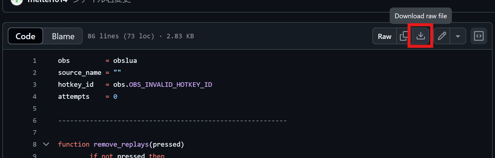
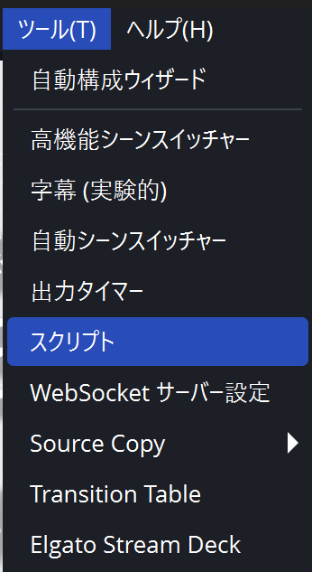
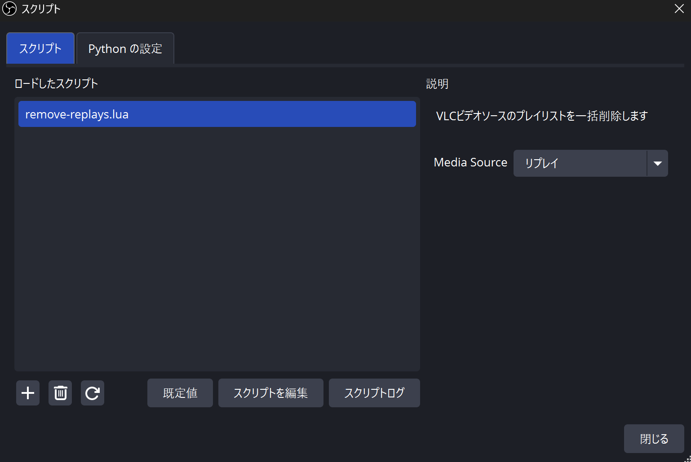
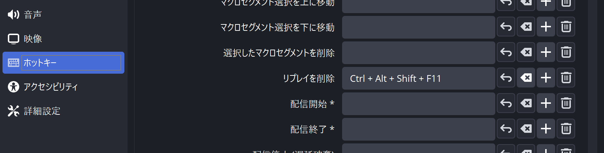

# このスクリプトについて
OBSのVLCビデオソースのプレイリストを、ホットキー一発で空にするスクリプトです。

大会配信などでリプレイをリプレイバッファで切り抜き、Directory Watch MediaでVLCビデオソースに流し込んだ後の削除作業を自動化できます。

参考: [【OBS】大会配信にリプレイを導入したい！ | くぼじ🌺](https://note.com/kubojilesia/n/n9b034197a96f)

# 使い方
1. [remove-replays.lua](https://github.com/meitel1014/remove-replays/blob/main/remove-replays.lua) ファイルをダウンロード、適当な場所に配置

（ファイルを開いて右上のダウンロードボタンが便利）

2. OBSの「ツール」→「スクリプト」を選択

3. 左下の「+」をクリックし、ダウンロードしたスクリプトを選択
4. 「remove-replays.lua」が追加されるのでクリック
5. Media Source のドロップダウンから、リプレイ映像を流すソースを選ぶ

6. OBSの設定→ホットキー に、「リプレイを削除」が追加されているので、適当なホットキーを設定

ここまで設定したら、6. で設定したホットキーを押すことでリプレイ映像が全てソース上から削除されます。（録画ファイル自体は削除されません）

## 注意
スクリプトの追加はシーンコレクションに紐づいているようです。

スクリプトを追加したものと別のシーンコレクションを使う場合、使い方の2.から設定し直してください。

# 補足
OBS公式の[instant-replayスクリプト](https://github.com/obsproject/obs-studio/blob/master/frontend/plugins/frontend-tools/data/scripts/instant-replay.lua)をベースとしています。
そのためライセンスをOBSと同じGPL v2.0としています。使用する分には特に気にする必要はありません。
