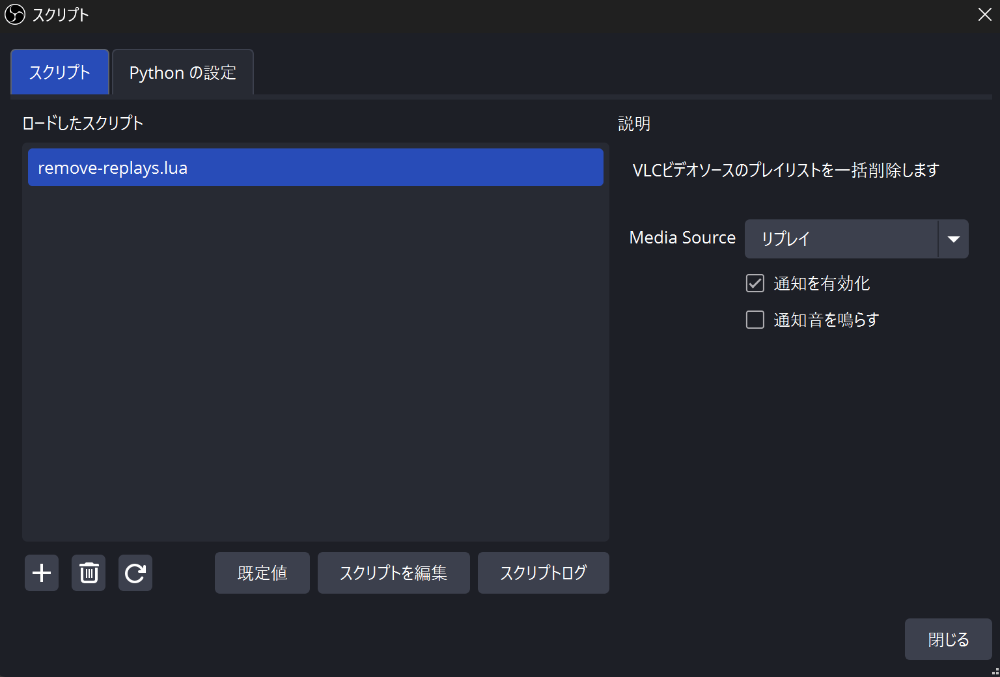
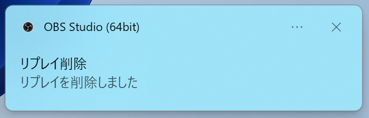

# このスクリプトについて
OBSのVLCビデオソースのプレイリストを、ホットキー一発で空にするスクリプトです。

大会配信などでリプレイをリプレイバッファで切り抜き、Directory Watch MediaでVLCビデオソースに流し込んだ後の削除作業を自動化できます。

参考: [【OBS】大会配信にリプレイを導入したい！ | くぼじ🌺](https://note.com/kubojilesia/n/n9b034197a96f)

# 使い方
1. [remove-replays.lua](https://github.com/meitel1014/remove-replays/blob/main/remove-replays.lua) ファイルをダウンロード、適当な場所に配置

（ファイルを開いて右上のダウンロードボタンが便利です。Gitが使える方はgit cloneでもOKです）

Windowsで後述の通知機能を使いたい方は、[windows-notification.ps1](https://github.com/meitel1014/remove-replays/blob/main/windows-notification.ps1) ファイルも同じ場所にダウンロードしてください。
（通知機能が不要な方や、MacなどでOBSを使っている方は不要です。）

2. OBSの「ツール」→「スクリプト」を選択

3. 左下の「+」をクリックし、ダウンロードしたスクリプトを選択
4. 「remove-replays.lua」が追加されるのでクリック
5. Media Source のドロップダウンから、リプレイ映像を流すソースを選ぶ

6. OBSの設定→ホットキー に、「リプレイを削除」が追加されているので、適当なホットキーを設定

ここまで設定したら、6. で設定したホットキーを押すことでリプレイ映像が全てソース上から削除されます。（録画ファイル自体は削除されません）

## 通知機能
使い方の5.の画面で、「通知を有効化」にチェックを入れると、ホットキーを押した時に通知を鳴らすことができます。

「通知音を鳴らす」にチェックを入れると音も鳴ります。配信に余計な音を入れたくない場合はチェックを外してください。

> [!WARNING]
> Windowsの方のみ、remove-replays.luaファイルと同じフォルダに[windows-notification.ps1](https://github.com/meitel1014/remove-replays/blob/main/windows-notification.ps1)ファイルをダウンロードしないと動作しません！

# 注意
スクリプトの追加はシーンコレクションに紐づいているようです。

スクリプトを追加したものと別のシーンコレクションを使う場合、使い方の2.から設定し直してください。

# 補足
OBS公式の[instant-replayスクリプト](https://github.com/obsproject/obs-studio/blob/master/frontend/plugins/frontend-tools/data/scripts/instant-replay.lua)をベースとしています。
そのためライセンスをOBSと同じGPL v2.0としています。使用する分には特に気にする必要はありません。
